# GUIA DO ZIMATISE - Produzir Coleções Online no Telegram

Versão v105

## Sumário

- [GUIA DO ZIMATISE - Produzir Coleções Online no Telegram](#guia-do-zimatise---produzir-coleções-online-no-telegram)
  - [Sumário](#sumário)
  - [Importante](#importante)
  - [Introdução](#introdução)
  - [1 - Com chocolatey é mais gostoso](#1---com-chocolatey-é-mais-gostoso)
  - [2 - Instalação manual](#2---instalação-manual)
    - [2.1 ffmpeg](#21-ffmpeg)
      - [Para obter o ffmpeg:](#para-obter-o-ffmpeg)
      - [Configurando o ffmpeg:](#configurando-o-ffmpeg)
        - [Adicionar pasta às variáveis de ambiente](#adicionar-pasta-às-variáveis-de-ambiente)
    - [2.2 python](#22-python)
      - [Para obter o python:](#para-obter-o-python)
    - [2.3 Compactadores-Winrar ou 7zip](#23-compactadores-winrar-ou-7zip)
  - [3 Preparação os utilitários](#3-preparação-os-utilitários)
    - [3.1 - Modo simples - Kit configurado em ptbr](#31---modo-simples---kit-configurado-em-ptbr)
    - [3.2 - Modo avançado - Construa e configure do zero](#32---modo-avançado---construa-e-configure-do-zero)
      - [Como baixar](#como-baixar)
    - [Atualizações de dependências](#atualizações-de-dependências)
  - [4 Como utilizar os utilitários - O segredo do Processo Automático e Upload eficiente](#4-como-utilizar-os-utilitários---o-segredo-do-processo-automático-e-upload-eficiente)
    - [4.1 - Modo silencioso - Veloz e Furioso](#41---modo-silencioso---veloz-e-furioso)
    - [4.2 ETAPA 1 - Compactação de arquivos](#42-etapa-1---compactação-de-arquivos)
    - [4.3 ETAPA 2 - Gerar relatório de arquivos de vídeos](#43-etapa-2---gerar-relatório-de-arquivos-de-vídeos)
    - [4.4 ETAPA 3 - Reencode - Transformação de perfis](#44-etapa-3---reencode---transformação-de-perfis)
    - [4.5 ETAPA 4 - Agrupamento dos vídeos](#45-etapa-4---agrupamento-dos-vídeos)
    - [4.6 ETAPA 5 - Descrições dos vídeos e do Projeto](#46-etapa-5---descrições-dos-vídeos-e-do-projeto)
      - [4.6.1 Ajustes das Descrições](#461-ajustes-das-descrições)
    - [4.7 ETAPA 6 – O Upload](#47-etapa-6--o-upload)
      - [Upload via API do telegram](#upload-via-api-do-telegram)
        - [Configuração de token](#configuração-de-token)
        - [Envio para novo canal](#envio-para-novo-canal)
        - [Envio para canal já existente](#envio-para-canal-já-existente)
      - [Upload via Macro de Teclado](#upload-via-macro-de-teclado)
      - [Após o Upload](#após-o-upload)
  - [Customização e maiores detalhes](#customização-e-maiores-detalhes)
    - [Aplicação de assinatura no sumário do canal](#aplicação-de-assinatura-no-sumário-do-canal)
    - [Ativação do Efeito de Transição nos vídeos](#ativação-do-efeito-de-transição-nos-vídeos)
    - [Padronização de Descrição do projeto](#padronização-de-descrição-do-projeto)
    - [Separação dos vídeos e demais materiais](#separação-dos-vídeos-e-demais-materiais)
    - [Definição de limites de tamanho e duração](#definição-de-limites-de-tamanho-e-duração)
    - [Ajustes manuais no plano de reencode](#ajustes-manuais-no-plano-de-reencode)
    - [Retomar processo interrompido](#retomar-processo-interrompido)
    - [Conectar Zimatise com Zipsender](#conectar-zimatise-com-zipsender)
    - [Evite upload de arquivo travado em 100%](#evite-upload-de-arquivo-travado-em-100)
  - [Conclusão](#conclusão)

## Importante

Nenhum dos softwares utilizados nesse tutorial possui relação direta como o objetivo deste tutorial.

O uso dos softwares em conjunto para qualquer objetivo, é por uma decisão individual de responsabilidade de cada usuário.

## Introdução

Este tutorial ensinará como disponibilizar uma coleção audiovisual no telegram de modo que possa ser assistida online, sem precisar fazer download.

Com funções especiais, como:
- Agrupamento opcional de pequenos videos formando grandes blocos, para reduzir a quantidade de vídeos postados
- Menu interativo na descrição dos blocos, para navegar entre os diferentes capítulos
- Assinatura personalizada em cada postagem
- Materiais de não-videos (pdfs e etc) lançados em pacotes divididos de forma independente
- Descrição do canal gerada automaticamente em modelo pré-configurado. Podendo descrever o tamanho do material, duração e link de convite
- Efeitos de transição entre os capítulos de um bloco de vídeo
- Criação automática de novo canal para cada novo projeto
- Inclusão automática de administradores durante a criação do canal

Veja alguns exemplos do resultado que você será capaz de produzir ao seguir este tutorial.
- [single mode](https://t.me/+EQA5GVHUo-Y1ODdh)
- [group mode](https://t.me/+ZdubDTqIH3gyYzJh)

O processo foi construído para ser eficiente, não tomando mais que 3 minutos de atenção para finalizar um projeto, ainda que contenha dezenas de horas e centenas de gbs.

O Zimatise é o app que facilita o fluxo de atividade para processar e upar coleções audiovisuais no telegram.

Ele pode ser usado em sistema operacional Windows (10 ou 11 de 64 bits), linux e tem por dependência, os softwares:
O Python, ffmpeg e o Compactador.

## 1 - Com chocolatey é mais gostoso

Chocolatey é um gerenciador de pacote para sistema operacional Windows. Com ele, podemos instalar todos os softwares necessários por comandos no terminal, sem precisar entrar em cada site, fazer downloads e instalar cada aplicação manualmente. Ele permite instalar diversos softwares numa velocidade incrível. :)

**Instalar o chocolatey**

Assim como explicado na [página de instalação](https://chocolatey.org/install) do chocolatey, abra o powershell do windows com privilégio de administrador e execute o comando abaixo:
`Set-ExecutionPolicy Bypass -Scope Process -Force; [System.Net.ServicePointManager]::SecurityProtocol = [System.Net.ServicePointManager]::SecurityProtocol -bor 3072; iex ((New-Object System.Net.WebClient).DownloadString('https://community.chocolatey.org/install.ps1'))`

Caso você não saiba abrir o powershell:
1. Aperte a tecla windows (fica geralmente entre control e alt da esquerda)
2. Digite `powershell`
3. Clique com o botão direito no ícone do windows powershell
4. Clique na opção "Executar como administrador"

O chocolatey só será instalado adequadamente se você executar o powershell com privilégio de administrador.

**Instalar os pré-requisitos**

```
choco install python -y
choco install git -y
choco install ffmpeg -y
choco install 7zip -y
choco install advanced-renamer -y
```

Abra o terminal do windows com privilégio administrador e execute cada um dos comandos acima.

É fortemente recomendado a instalação do app "advanced renamer", que é um aplicativo que renomeia arquivos e pastas em lote. No uso do Zimatise você sentirá necessidade de renomear diversos arquivos e pastas, onde esta aplicação deixará tudo muito mais rápido e fácil.

**Baixar o Zimatise**

1. Crie uma pasta vazia chamada "zimatise" na raiz do seu HD. Entre nela.
2. Digite `CTRL+L` no windows explorer.
3. Digite `cmd` na barra de endereço e tecle enter para abrir o terminal dentro da pasta do zimatise.
4. Execute cada um dos comandos abaixo

```
git clone https://github.com/apenasrr/zimatise
cd zimatise
update_libs.bat
```

Agora que o Zimatise já está baixado, você pode pular para o tópico [4 Como utilizar os utilitários - O segredo do Processo Automático e Upload eficiente](#4-como-utilizar-os-utilitários---o-segredo-do-processo-automático-e-upload-eficiente).

Mas caso deseje conhecer mais um pouco sobre cada pré-requisitos e seu processo manual de instalação e configuração, tenha uma boa leitura. :p


## 2 - Instalação manual
### 2.1 ffmpeg

O ffmpeg é uma "caixa de ferramenta" que pode ser utilizada via linha de comando por qualquer linguagem de programação para fazer dezenas de operações com arquivos áudio, vídeo e legendas, incluindo transformar vídeos (codecs, resolução, bitrate) e extrair quaisquer informações (metadados) sobre esses arquivos.

Ele só funciona em windows de 64 bits. Se você usa windows 32 bits, não poderá usar o Zimatise até q mude o sistema operacional.


Antes de tudo, abra o Windows Explorer e garanta a exibição das extensões dos arquivos. É fácil. Vá no menu "Exibir" e então marque o checkbox “Extensões de nomes de arquivos”.

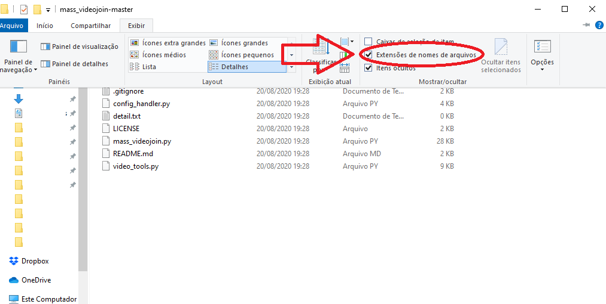


#### Para obter o ffmpeg:
- Baixe a partir deste [link direto]((https://www.gyan.dev/ffmpeg/builds/ffmpeg-git-full.7z)), que contém a versão completa e atualizada do programa. Ou siga os passos abaixo.
- Acesse [https://ffmpeg.org/download.html](https://ffmpeg.org/download.html).
- No campo “get packages & executable files”, clique no botão que representa o Windows.
- Logo em seguida, escolha a opção `Windows builds from gyan.dev`
- Em seguida clique no link [https://www.gyan.dev/ffmpeg/builds/ffmpeg-git-full.7z](https://www.gyan.dev/ffmpeg/builds/ffmpeg-git-full.7z)

#### Configurando o ffmpeg:
- Felizmente o ffmpeg não se instala, sendo uma aplicação portátil (portable). É necessário apenas o configurar para que seja possível o utilizar por terminal a partir de qualquer local ou pasta do PC. Este processo é chamado de `Adicionar pasta às variáveis de ambiente`

Primeiramente é preciso obter o caminho da pasta `bin` que existe dentro da pasta criada para o ffmpeg.
- Caso se tenha criado a pasta do ffmpeg na "unidade C", a pasta `bin` estará no caminho: `C:\ffmpeg\bin`. Guarde o caminho da pasta, pois será usada na inclusão às variáveis de ambiente.

##### Adicionar pasta às variáveis de ambiente
Será ensinado duas formas de fazer isso:
- A rápida, via terminal
- E simpática, via interface gráfica (GUI)

Execute apenas uma das formas.

**Rápido: Via Terminal**

- Abrir Terminal com privilégio de admin
  - `[WIN]+R, cmd, [CTRL]+[SHIFT]+[ENTER]`
- Entrar com o comando: `setx /M path "%path%;{path_folder}"`
	- Substituir `{path_folder}` pelo link da pasta a ser adicionada nas variáveis de sistema
	- Exemplo caso a pasta esteja em `C:\myapp`
		- `setx /M path "%path%;C:\myapp"`


**Simpático: Via interface gráfica**
- Escolha um diretório e crie uma pasta com o nome `ffmpeg`.
- O arquivo baixado deve ser extraído nesta pasta vazia que foi criada.
- Para o ffmpeg ser acessável via terminal a partir de qualquer local do seu sistema, busque o termo `variáveis de ambiente` na ferramenta de busca do windows e acesse a aplicação `editar as variáveis de ambiente do sistema`.
- Na aplicação que será aberta, acesse a guia `Avançado` e clique no botão `Variáveis de Ambiente`.

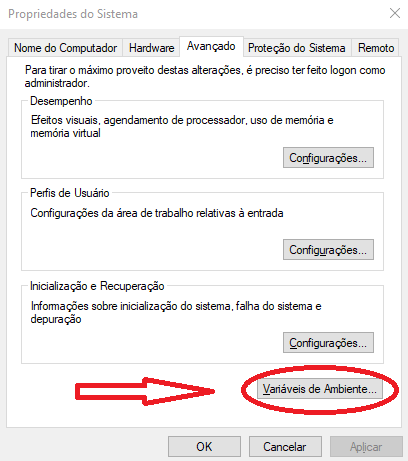

- No form "Variáveis de Ambiente", clique no nome `Path` na coluna `Variável`. Em seguida clique no botão `Editar`.

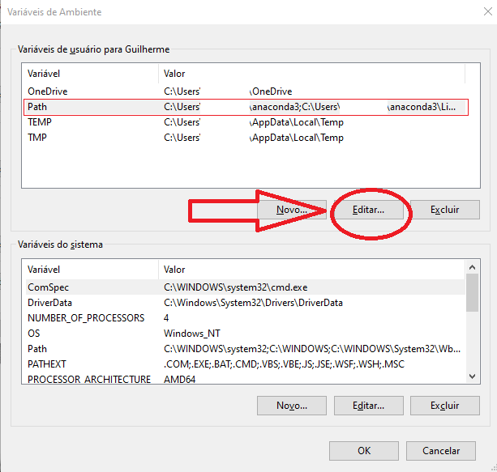

- No form "Editar a variável de ambiente", clique no botão "Novo" e adicione o caminho da pasta `bin` que existe dentro da pasta criada para o ffmpeg.
- Caso se tenha criado a pasta na "unidade C", a pasta `bin` estará no caminho: `C:\ffmpeg\bin`

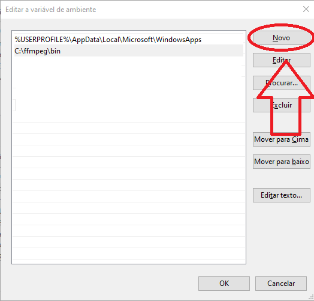

- Para evitar erros, logo após adicionar o novo caminho, selecione o novo caminho adicionado, em seguida clique no botão `Mover para Cima`.
- Esta ação dará ao path criado, maior prioridade em relação aos demais paths da lista.

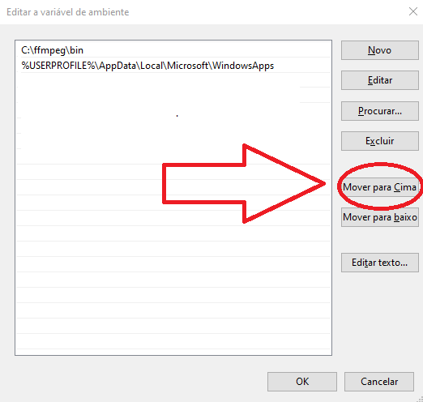

- Parabéns. O ffmpeg foi configurado como variável de sistema!
- Para verificar se está tudo funcionando bem, basta abrir o cmd do Windows: (`[win]+[r], cmd, [enter]`)
- Em seguida digite `ffmpeg` no terminal aberto e tecle `[Enter]`. O resultado deve ser similar a imagem abaixo.

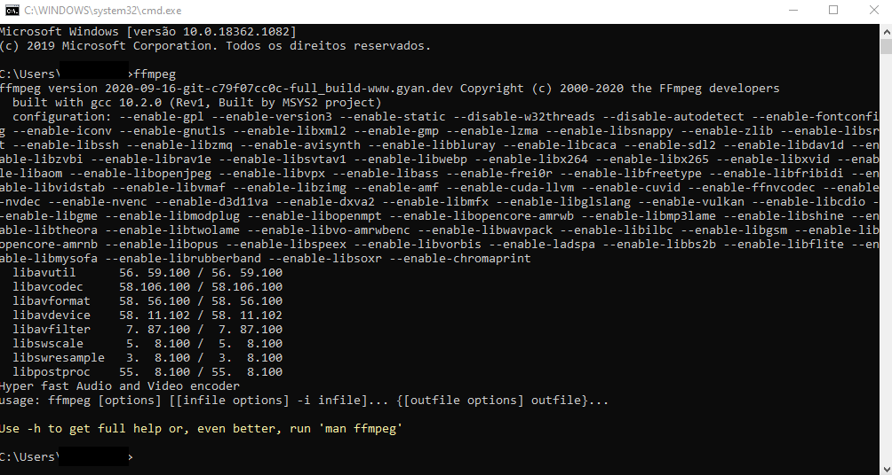


### 2.2 python
Python é uma linguagem de programação de propósito genérico ao qual o Zimatise e seus apps dependentes foram construídos.

#### Para obter o python:
* Acesse o site python.org e [baixe](https://www.python.org/downloads/) a versão estável mais nova.
* No form 'Advanced Options', marque `Add python 3.?? to PATH`. Esta função automatiza a inclusão do Python no Path do windows, dispensando a repetição do trabalho executado no tópico anterior, com o ffmpeg.
* Clique em `Install`
* A instalação pode demorar alguns minutos, mas isso é normal.

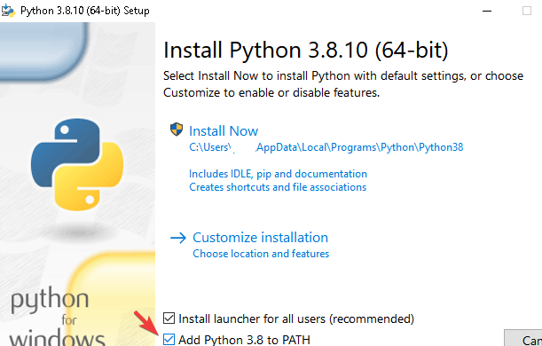

### 2.3 Compactadores-Winrar ou 7zip
Winrar ou 7zip são softwares compactadores que permitem agregar vários arquivos dentro de um único arquivo, facilitando o envio/recebimento de todo o 'pacote de arquivos' como um único arquivo.

App [Winrar](https://www.win-rar.com/predownload.html?&L=9)
- Possibilita usar a suite para compactar arquivos em modo '.rar'.
- Exclusivo para sistema operacional Windows.

App [7zip](https://www.7-zip.org/download.html)
- Possibilita usar a suite para compactar arquivos em modo '.zip'.
- Funciona em Windows e Linux.
- Preferência de quem usa sistema operacional Linux.

Configuração:
- Instale o compactador que preferir ou ambos.
- Adicione a pasta do app às variáveis de ambiente seguindo os mesmos passos realizados anteriormente quando se instalou o ffmpeg, no tópico `Adicionar pasta às variáveis de ambiente`.


## 3 Preparação os utilitários

> Importante\
> Os utilitários devem ser colocados dentro de uma pasta na raiz de uma unidade do seu pc. Ex.: `D:/zimatise_suite`\
> Este detalhe evita que existam erros de [max_path](https://docs.microsoft.com/pt-br/windows/win32/fileio/maximum-file-path-limitation) durante o processamento dos projetos.

Você pode adquirir o zimatise pelo modo simples ou avançado.

Recomendamos o modo simples para quem não deseja investir tempo aprendendo o processo de configuração e customização neste momento. Escolha um modo.

### 3.1 - Modo simples - Kit configurado em ptbr

1. Acesse o canal do [telegram do zimatise](https://t.me/zipsender) e baixe a última versão já configurada em ptbr.

2. Descompacte numa pasta na raiz de uma unidade do pc, conforme sugerido anteriormente.

### 3.2 - Modo avançado - Construa e configure do zero

Baixe o zimatise do seguinte link:

1. Zimatise: [https://github.com/apenasrr/zimatise](https://github.com/apenasrr/zimatise)

#### Como baixar
- Clique no botão “Code” e, em seguida,
- Clique em “Download ZIP”.

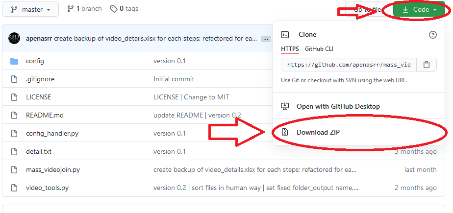

- Extraia utilitário numa pasta vazia.
- Retire o termo `“-master”` do nome da pasta extraída.


### Atualizações de dependências
O python é uma linguagem de programação, onde durante a atividade de programação, vários 'atalhos' são pegos através do uso de scripts que foram criados por outras pessoas. Esses scripts são chamados de 'Libs' (bibliotecas).

O Zimatise possui diversas libs requeridas, que precisamos baixar e atualizar.

Para facilitar o processo, tudo foi resumido à execução de 1 arquivo.
- Na pasta do zimatise, execute o arquivo `update_libs.bat`.

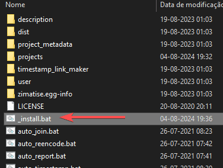


## 4 Como utilizar os utilitários - O segredo do Processo Automático e Upload eficiente

Agora que todas as ferramentas estão prontas, é hora de utilizá-las.

- Acesse a pasta do Zimatise e execute o arquivo “zimatise_one.bat”
- Será aberto um `terminal` com um menu simples

### 4.1 - Modo silencioso - Veloz e Furioso

O zimatise vem com a opção modo silencioso (silent_mode) ativada. Essa opção permite que com um único comando, todo o projeto seja processado e enviado para o telegram. Sem necessidade de ajustes, sendo muito rápido, porém pouco flexível.

Vamos começar com o modo silencioso por ser mais fácil e rápido.

> ATENÇÃO
> 1) Mova a pasta do projeto audio-visual para a raiz de sua unidade de disco.\
> Caso seu disco principal seja a unidade `C` e a pasta do projeto se chame `meu_projeto`, após a pasta ser movida, o caminho para ela será: `C:\meu_projeto`.\
> Este processo é importante pois o arquivo compactado preserva a estrutura hierárquica das pastas, gerando um resultado inconveniente caso o projeto esteja submerso em diversas pastas no seu PC.\
> Após a finalização do projeto, você pode o mover de volta para a pasta que achar conveniente.

> 2) `Lembre-se de teclar [Enter] após digitar uma resposta em cada etapa.`

> 3) Pule rapidamente para a sessão [Upload via API do telegram](#upload-via-api-do-telegram) deste tutorial, para gerar um token e configurar as credenciais do seu telegram, pois o Modo Silencioso envia o projeto para o telegram através de sua API. Prossiga o tutorial em seguida.

- Na mensagem que aparecerá no terminal, aperte `[Enter]` para prosseguir no modo silencioso.
> `Continue to silent mode? (y/n)`
- Na mensagem que aparecerá no terminal, cole o caminho da pasta do projeto audio-visual.
- Na primeira vez que você for usar o zimatise, será preciso autenticar uma conexão com o telegram. Ms será só da primeira vez! E depois nunca mais. :) Autenticar é simple, segue os passos:
  - Aparecerá uma mensagem pedindo o número de seu telefone em formato internacional. Com prefixo `+55` para o caso de telefone brasileiro, seguido do DDD local e seu número de telefone.
    - Exemplo: Para telefone de São Paulo, com ddd 11, deverá ser digitado algo como: `+5511995429405`
  - Na mensagem perguntando se o número está correto, digite `y`.
  - Se você tiver 'segurança de 2 fatores' (2fa) ativado na sua conta, será solicitado sua senha.
- Se por algum motivo paranoico você NÃO quiser fazer a autenticação da API do telegram, ainda há esperanças de usar o Zimatise. Você pode fazer o envio do projeto através de macro de teclado que será ensinado mais adiante. hehe

Cumprindo bem todos os passos anteriores, não surgirá nenhum erro e a postagem em modo stream será questão de tempo... Em alguns minutos surgirá um novo canal no seu telegram com o nome do projeto e os arquivos e vídeos serão enviados um a um dentro dele, finalizando com a postagem de um menu interativo.

Parabéns! \ o /

O tutorial já poderia terminar por aqui... Mas vamos além. O zimatise permite customizar cada etapa do processo. Vamos explorar essa ferramenta além do 'modo silencioso' e conhecer mais sobre cada etapa do processo.

### 4.2 ETAPA 1 - Compactação de arquivos

- Na mensagem que aparecerá no terminal, digite `n` e depois aperte `[Enter]`, assim pulamos o modo silencioso e entramos no modo manual.
> `Continue to silent mode? (y/n)`
- No menu de opções, escolha a primeira opção digitando `1` e confirmando ao teclar `[Enter]`

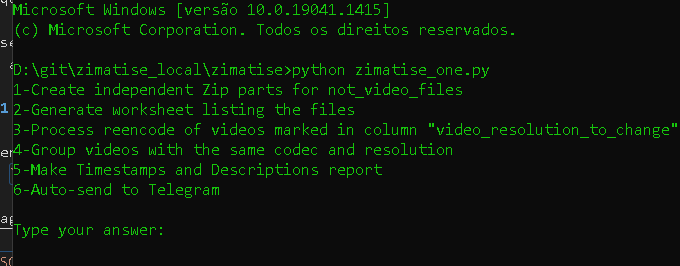

- Informe o caminho da pasta raiz do projeto.
- Para copiar o caminho, acesse a pasta pelo `Windows Explorer` e tecle `[ctrl]+[L], [ctrl]+[c]`
- Caso ao tentar no colar no terminal, o atalho `[ctrl]+[v]` não funcione, clique com o botão direito do mouse dentro do terminal, que o caminho será colado.
- Confirme com `[Enter]` duas vezes
- O processo de compactação será como na próxima imagem:

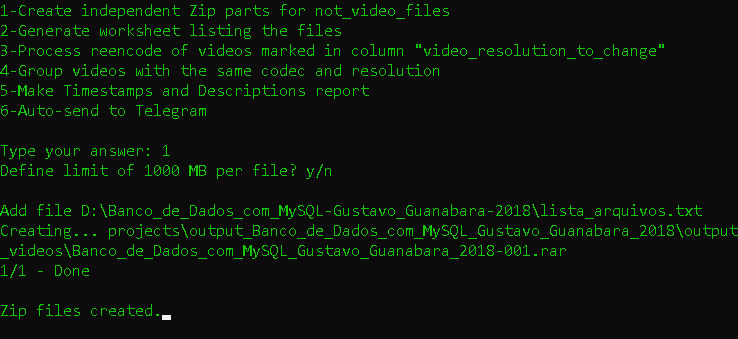

Os arquivos temporários para processamento do projeto será alocado na pasta de análise do seu projeto (`zimatise\projects\output_{nome_do_projeto}`). Ao longo de cada etapa você pode observar os arquivos empacotados aparecendo lá, relatórios e vídeos convertidos.

Para liberar espaço no seu PC, você pode apagar a pasta de análise do seu projeto após finalizar o envio para o telegram.

### 4.3 ETAPA 2 - Gerar relatório de arquivos de vídeos

Esta etapa gera um relatório `video_details.csv` com a lista de todos os vídeos de seu projeto e todos os metadados desses vídeos.

Caso o zimatise esteja configurado como modo `group` na variável `reencode_plan` no arquivo `zimatise\config.ini`, esta etapa também fará uma análise para saber como agrupar os vídeos em grandes blocos com uma determinada duração máxima em horas e/ou de tamanho máximo definido em megabytes.

Vamos explicar melhor sobre esse agrupamento do modo `group`.
Para isso ser possível, os vídeos a serem agrupados precisam ter o mesmo perfil, com o mesmo **encode de áudio, vídeo**, mesma **extensão** e mesma **resolução**.

O processo de transformação dos vídeos para ficarem com o mesmo perfil, se chama `homogeneização de perfis`.

Continuemos com a geração do relatório:
- Ative a segunda opção digitando `2`
- Informe o caminho da pasta do projeto novamente e aguarde o processo de listagem
- Após a conclusão do processo, o utilitário informará os perfis encontrados nos vídeos da pasta e montará um plano de ajuste automático (processo de reencode).
- Se na configuração do zimatise, o `reencode_plan` estiver como `single`, esse plano de ajuste se preocupará apenas em garantir que todos os vídeos tenham codec x264/aac e extensão mp4.
- Já se o `reencode_plan` estivar como `group`, esse plano de ajuste também se buscará homogeneizar o perfil dos vídeos de uma mesma subpasta de primeiro nível.

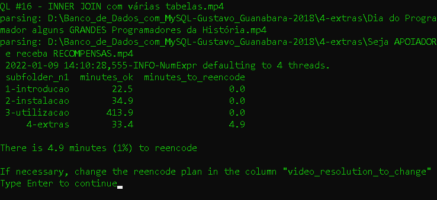\
Para o exemplo da imagem acima, existem apenas 5 minutos de vídeo para ser reencodado, na última pasta do projeto.

> ATENÇÃO\
> Execute a próxima etapa mesmo que não haja minutos de vídeo para ser reencodado, pois nesta etapa também são geradas transformações no relatório que são essenciais para o processo seguir adequadamente.

### 4.4 ETAPA 3 - Reencode - Transformação de perfis

O próximo **passo** é o de reencodar os vídeos, executando o plano de reencode montado no passo anterior. Assim garante que os vídeos sejam capazes de serem reproduzidos online, considerando que a [exigência do Telegram](https://core.telegram.org/blackberry/chat-media-send) para reproduzir vídeos é que sejam mp4 com codec de vídeo x264 e codec de áudio aac.

Este processo pode demorar entre 2% e 50% da duração total dos vídeos à serem transformados de acordo com o plano de reencode. Tudo dependerá da situação que o projeto está em relação aos codecs, extensões e resoluções.

Assim, se o plano de reencode contiver 10 horas de vídeos, o processo de reencode pode demorar entre 12 minutos à 5 horas... Impossível prever com exatidão.

- Selecione a terceira opção digitando `3` e aguarde a conclusão do processo.

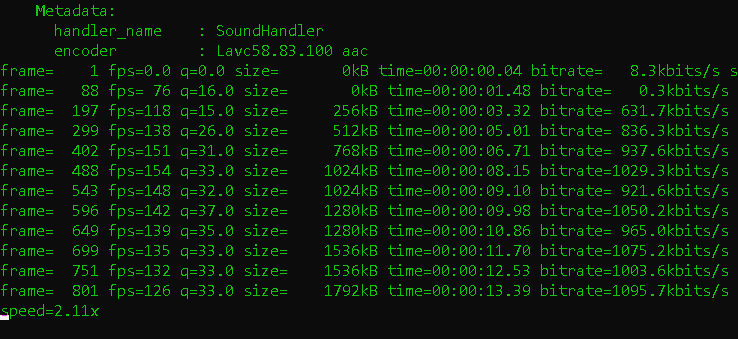

- Após o final do processo de reencode, o resultado será similar ao da imagem a seguir:

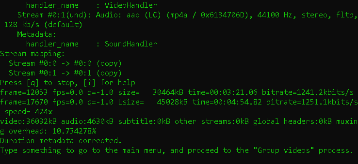

### 4.5 ETAPA 4 - Agrupamento dos vídeos

> ATENÇÃO\
> Execute esta etapa ainda que o zimatise esteja configurado com `reencode_plan` como `single`, pois nesta etapa também são geradas transformações no relatório que são essenciais para o processo seguir adequadamente.

- O agrupamento obedecerá 5 critérios:
  - Vídeos com perfil (resolução/codec/extensão), processado na etapa de reencode
  - Limites de tamanho de arquivo e duração máxima dos vídeos
  - E ajustes manuais pelo usuário realizados no relatório
- Selecionar a quarta opção digitando `4` e tecle `[Enter]`
- Ao aparecer a mensagem `Review the file and then type something to start (...)`, é possível fazer ajustes manuais no plano de reencode, que será ensinado mais adiante neste tutorial.
- Tecle `[Enter]` novamente para iniciar o processo de agrupamento dos vídeos.

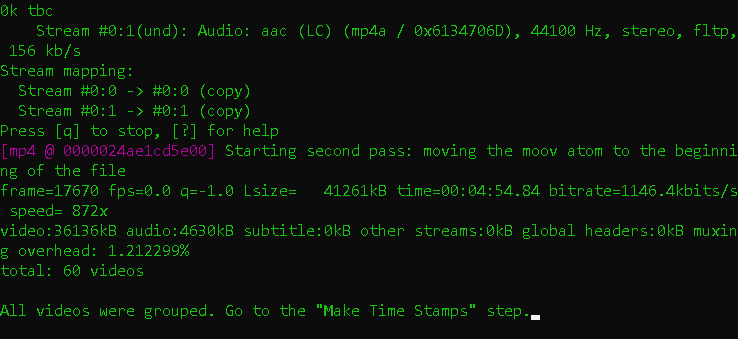

### 4.6 ETAPA 5 - Descrições dos vídeos e do Projeto

Este é a etapa da geração planilha `upload_plan.csv`, que contém as descrições dos blocos de vídeos, com marcação temporal (timestamps) que servirá de menu de navegação para cada bloco.

Também será gerado o arquivo `header_project.txt`, contendo a descrição do Canal conforme modelo configurado.

Ambos arquivos serão salvos na pasta de análise do projeto (`zimatise\projects\output_{nome_do_projeto}`).
- Selecionar a quinta opção digitando `5`
- Confirme com a tecla `[Enter]` para gerar o arquivo `upload_plan.csv`.
- Após gerado, aparecerá a mensagem: `TimeStamp and upload_file files created`

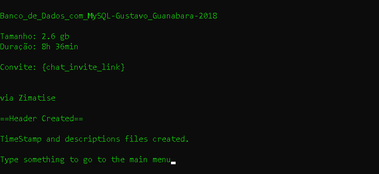

#### 4.6.1 Ajustes das Descrições

Este é uma etapa opcional, para ajustar as descrições dos vídeos ou tratar erro de descrição longa demais.
- Acesse o relatório `upload_plan.csv`
- Neste relatório é possível ajustar a descrição que cada vídeo terá após enviado para o telegram.
- Vale destacar que o zimatise já possui uma configuração ativa para impedir que a descrição de um vídeo ultrapasse o limite máximo permitido pelo telegram. Mas caso exista avisos na coluna `"warning"` indicando `"max size reached"`, significa que para o vídeo daquela linha, a descrição gerada ultrapassa o limite do Telegram de 1000 caracteres (contendo os espaços). Vamos explicar como resolver esse raro problema:

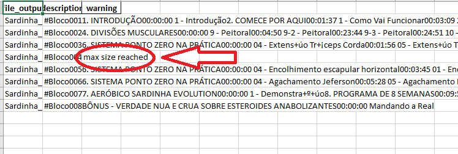

- Essas descrições precisam ser alteradas para evitar uma colagem incompleta no Telegram.
- Para alterar, clique duas vezes na célula da descrição com problemas
- Ela se expandirá e será possível copiar o texto e colá-lo em um editor de texto (para fechar a célula, basta apertar `Esc`), ou ainda alterar no próprio Excel.
- Nesse tutorial será utilizado o software "Microsoft Word" para corrigir as descrições com problemas.

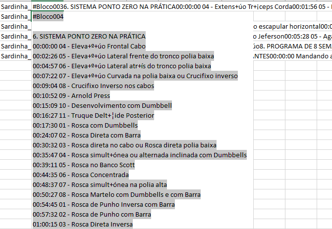

- Usando a contagem de caracteres do Word é possível ver quantos caracteres existem no documento, e, por dedução, quantos deverão ser cortados:

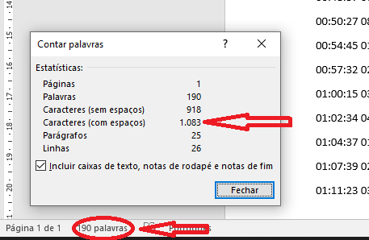

- Uma função muito útil do Word para correção de textos é a de substituição, segue um exemplo de uso:

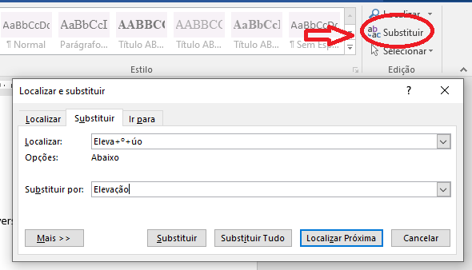

- Depois que a descrição estiver com 1000 caracteres ou menos, copie e a cole na célula do Excel de onde ela foi originalmente copiada.

### 4.7 ETAPA 6 – O Upload
Existem dois métodos para fazer o upload para o Telegram.

O método automatizado via Macro de Teclado e o método através da API do telegram.

> Atenção: O método de envio por Macro de teclado foi desabilitado em setembro/2022, mas será reativado no futuro

Neste tutorial, ambos métodos serão abordados, mas é recomendado utilizar o método através da API do telegram, para ser mais eficiente no processo e minimizar riscos de erros manuais.

> Por que enviar pela API do Telegram?\
> R: Porque é mais rápido. Não gera conflito com máquinas virtuais onde você não pode utilizar macro de mouse/teclado. Não ocupa sua máquina durante a preparação do envio. Não congela a capacidade de enviar arquivos em seu app do Telegram enquanto upa os vídeos.

> Quando enviar via Telegram app é preferível?\
> R: Quando você tem preguiça de aprender a gerar um token de acesso para sua conta do telegram e configurar no Zimatise. Preguiça essa que te fará perder muito mais tempo no upload de todos os projetos que processar.

#### Upload via API do telegram

##### Configuração de token
Para se conectar ao Telegram via API, é necessário obter um `api_id` e um `api_hash`.\
Mas não se preocupe, só é necessário seguir essas etapas uma vez na vida:
- Para obter as credenciais para a API do Telegram:
  - Acesse a área de [gestão de apps](https://my.telegram.org/auth?to=apps) no site do telegram.
  - Entre com seu número de telefone em modelo internacional. Com prefixo `+55` para o caso de telefone brasileiro, seguido do DDD local e seu número de telefone.
    - Exemplo: Para telefone de São Paulo, com ddd 11, deverá ser digitado algo como: `+5511995429405`
  - Preencha o formulário e então aparecerá seus códigos de `api_id` e `api_hash`
  - Para assistir o processo em detalhes, assista [este vídeo](https://www.youtube.com/watch?v=8naENmP3rg4) que exemplifica tudo rapidamente.
- Após obter sua `api_id` e `api_hash`, guarde em um **local seguro**. Pois no futuro você poderá precisar delas para se relogar. Também essas credenciais são semelhantes a usuário-senha da sua conta, então **não compartilha com ninguém**!

##### Envio para novo canal
- Caso deseje criar um novo canal (opção mais rápida :satisfied:):
  - Não é necessário ajustar, pois o zimatise vem configurado para criação automática de novo canal para cada projeto.
  - Caso deseje **adicionar adms** automaticamente ao novo canal, adicione seus @Nicks separados por vírgura, na flag `channel_adms`  no arquivo: `zimatise\config.ini`. Exemplo:
    - `channel_adms = @zezinho,@juquinha,@pedrinho`
  - Caso deseje **personalizar automaticamente a descrição** do novo canal, é importante lembrar que o conteúdo já foi criado baseado num template, na Etapa 5. Mas caso prefira, revise:
    - Abra a pasta do projeto presente na pasta do Zimatise
    - Acesse o arquivo `header_project.txt` e customize conforme necessário, mas atendo para que a primeira linha seja o nome do canal e as demais linhas correspondam a sua descrição.
    - Se desejar, use a flag `{chat_invite_link}` para substituir automaticamente pelo link de convite para o novo canal.
> Nota: A substituição automática do `link de convite` é mais uma das vantagens do método de envio `'Via Telegram API'` em relação ao método `'via Macro de Teclado'`

##### Envio para canal já existente
Caso deseje enviar para um grupo/canal já existente (opção mais lenta :neutral_face:):
- Ajuste o arquivo de configuração
  - Primeiro, é preciso obter o `chat_id` do grupo/canal. Existem várias formas de obter o chat_id de um canal. Mostraremos duas delas:
    - Usando o telegram client [Kotatogram](https://kotatogram.github.io/download/):
      - Acesse a tela de descrição do canal
      - Copie o `chat_id` que aparece abaixo do nome do canal
    - Usando bot Find_TGIDbot:
      - Acesse a janela do bot [@Find_TGIDbot](http://t.me/Find_TGIDbot) e o inicie
      - Encaminhe qualquer postagem do canal para este bot
      - O bot responderá com o ID do remetente da mensagem. Neste caso, o ID do canal.
    - Copie o `chat_id` (incluindo o sinal de subtração). Vale ressaltar que canais começam com o número '-100'.
  - Abra o arquivo `zimatise/config.ini` em qualquer editor de texto
  - Altere a flag `chat_id` para o valor do chat_id copiado, semelhante ao exemplo abaixo
  - Exemplo: `chat_id = -1001111111`
  - Altere a flag `create_new_channel` para `0`, igual ao exemplo abaixo
  - Ex.: `create_new_channel = 0`
  - Salve e feche o arquivo

- Na janela do Zimatise, tecle `6` e confirme com `[Enter]`
- Tecle novamente `[Enter]` confirmando que será utilizado o arquivo `upload_plan.csv` existente
- Aparecerá a mensagem: `"How do you intend to send the files?"`
- Tecle `2`, informando que será utilizado o método via Telegram API.
- Aguarde a conclusão do Upload

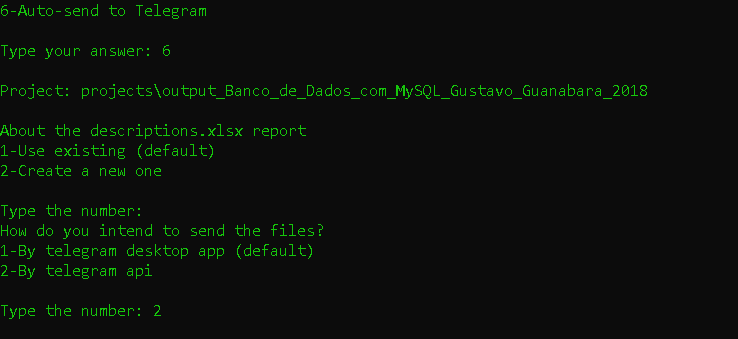


#### Upload via Macro de Teclado
> Atenção
> Ressaltamos que este método não é indicado. É lento e passivo de frequentes falhas. Opte pelo método via API do telegram.

- Crie um novo canal privado no Telegram
- Na descrição, cole o conteúdo do arquivo `header_project.txt` gerado na pasta do projeto. O ajuste caso necessário.

O upload pelo método via Macro de Teclado consiste em o script passar comandos de teclado para que cada arquivo de vídeo seja jogado de forma sequencial no app do Telegram juntamente com sua descrição.

Para executar esse método, é necessário um pequeno preparo para funcionar adequadamente:
- Abra a pasta dos vídeos agrupados do projeto a ser upado. Normalmente a pasta fica em: `zimatise/projects/output_{nome_do_projeto}/output_videos`
- Selecione o primeiro arquivo de vídeo.
- Siga os passos abaixo nesta exata ordem:
1. Deixe a janela da pasta dos vídeos aberta
2. Depois abra a janela do Telegram
3. Depois abra a janela do Zimatise
- Faça isso utilizando o comando `alt + tab`, para evitar que a seleção do vídeo se perca.
- Caso tenha errado a ordem de ativação das janelas, repita o processo até conseguir ativar as 3 janelas na exata ordem descrita.
   > Atenção: Caso não faça desta forma, há grande risco da automação gerar erros.
- Na janela do zimatise, tecle `6` e confirme com `[Enter]`
- Nas opções que aparecerão, tecle `[Enter]` confirmando que será utilizado o arquivo `upload_plan.csv` existente
- Aparecerá a mensagem: `"How do you intend to send the files?"`
- Tecle `1`, informando que será utilizado o método via Macro de Teclado, pelo app do Telegram.

- Neste momento não toque no teclado e aguarde a colagem dos vídeos no app do Telegram terminarQuando o processo automático terminar,

Caso prefira fazer o upload manualmente, não utilizando a função via Macro de Teclado, apenas arraste os vídeos para a janela do Telegram ou use o clipe de papel no canto inferior esquerdo do quadro do canal, copie e cole as descrições no relatório “upload_plan.csv" e repita o processo para todos os blocos, na ordem correta.


#### Após o Upload
- Após o término do upload, o menu de navegação será automaticamente postado no canal, facilitando o acesso aos diferentes vídeos e arquivos do projeto.
- O texto do menu de navegação se encontra no arquivo `summary.txt` presente na pasta de análise do projeto.

## Customização e maiores detalhes
### Aplicação de assinatura no sumário do canal
- O texto que aparecerá no post com o sumário dinâmico do material, possui um cabeçalho e rodapé personalizável.
- Para ajustar, altere o texto dos arquivos `“summary_top.txt”` (para cabeçalho) e `“summary_bot.txt”` (para rodapé), na pasta `"user"` dentro da pasta do Zimatise.
- No arquivo `“summary_bot.txt”`, troque o texto que está lá por esse:

```
Bons estudos!


```

- No arquivo `“summary_top.txt”`, troque o texto que está no arquivo por esse:

```
⚠ Atenção ⚠

Clique aqui para ver o Menu de navegação.
Utilize as # para navegar rapidamente no conteúdo.


Materiais em #Materiais
```

### Ativação do Efeito de Transição nos vídeos
Esta função é opcional e afeta o processo apenas na configuração de `reencode_plan = group`. Para desestimular a prática de cópia dos vídeos sem que haja citação a equipe que os processou, pequenos vídeos podem ser usados no início e final do bloco de vídeo, com também usado na forma de efeitos de transição, entre os diversos vídeos que foram agrupados.

O Zimatise é inteligente para gerar novos vídeos de transição com resoluções diferentes na medida em que haja necessidade de os agrupar com vídeos cuja resolução seja diferente das encontradas até então.

Para evitar grandes distorções no processo de adaptação de resolução, é recomendado que se crie 2 vídeos de transição com **alta definição**, mas possuindo uma relação de largura/altura (aspect ratio) de `16:9` e outra com `4:3`.
- Acesse a pasta do utilitário `vidtool`
- Em seguida acesse a pasta `transition`. Crie caso ela não exista.
- Cole os vídeos de transição nessa pasta.
- Em seguida acesse o arquivo de configurações (`zimatise\config.ini`) e defina a flag `activate_transition` como `'true'`.
- Caso não tenha interesse em usar o Efeito de Transição, defina a flag como `'false'`.


### Padronização de Descrição do projeto
A descrição do projeto pode ser automaticamente gerada, com algumas variáveis padronizadas, como tamanho do projeto em megabytes, duração em horas e até o 'link de convite', caso seja posteriormente enviado pela API do Telegram.
- Acesse o arquivo `zimatise\user\header_template.txt`
- O preencha com o texto abaixo:

```
{project_name}

{project_name}

Tamanho: {file_size}
Duração: {duration}

Convite: {chat_invite_link}


```

### Separação dos vídeos e demais materiais
Vídeos serão disponibilizados via streaming, mas demais arquivos serão empacotados. Para aplicar este método, é necessário informar ao Zimatise quais tipos de arquivos não deverão ser empacotados. Nativamente é informado uma lista de extensões de vídeos que guia essa separação, mas você pode ajustar essa listagem.
- Acesse a pasta do utilitário `zimatise`
- Abra o arquivo `config.ini`
- Na flag `video_extensions`, você pode alterar a lista de extensões de vídeos.

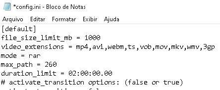


### Definição de limites de tamanho e duração
O processo de agrupamento dos vídeos é guiado por alguns limites para que o projeto não seja consolidado num único vídeo com dezenas de horas e gigabytes. A definição de limites sugerida está em sintonia com uma boa experiência em se assistir vídeos por stream.

- Acesse a pasta do utilitário `zimatise`
- Abra o arquivo `config.ini`
- Na flag `size_per_file_mb`, se altera o limite máximo em megabytes de cada bloco de vídeo.
- Na flag `duration_limit`, se altera a duração máxima de um bloco de vídeo.

### Ajustes manuais no plano de reencode
- Após o passo 3, quando aparecer a mensagem `"File [...] was updated with group column to fast join"`
- Neste momento é possível fazer ajustes manuais no plano de agrupamento, através do relatório `video_details.csv` presente na pasta do projeto dentro da pasta do `Zimatise`.
- Na coluna `group_encode`, é possível indicar que determinados vídeos fiquem em blocos diferentes dos que foram previamente alocados, alterando sua numeração sequencial.
- Este ajuste manual é útil para projetos sem hierarquia de pastas, onde a separação de módulos depende do julgamento de quem está operando.
- Como exemplo, a imagem abaixo demonstra um projeto cujo plano de agrupamento foi ajustado manualmente para que vídeos de módulos diferentes fiquem em blocos diferentes. Sendo os primeiros 4 vídeos num bloco. Do 5º ao 8º em outro boco. 9º ao 11º em outro bloco. E por fim, o último vídeo sozinho num bloco. As numerações dos grupos são sempre sequenciais.

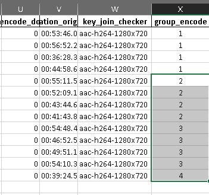

### Retomar processo interrompido

Tanto o upload, quanto as etapas de reencode e agrupamento podem ser continuadas de onde parou caso haja uma interrupção acidental, como queda de energia elétrica ou conexão.

Para retomar, siga os passos:
- Execute o zimatise normalmente
- Na mensagem que aparecerá no terminal, digite `n` e depois aperte `[Enter]`, assim pulamos o modo silencioso e entramos no modo manual.
> `Continue to silent mode? (y/n)`
- Digite o número da etapa que você deseja retomar.
- Aparecerá uma mensagem solicitando o local onde está a pasta raiz do projeto. Cole ela.
- Assim o zimatise será capaz de retomar o processo.

### Conectar Zimatise com Zipsender

Zimatise transforma coleções audiovisuais em canais do telegram que permite assistir tudo online. Zipsender transforma coleções em pacotes divididos de forma independente em canais do telegram.

Caso o interesse seja ter as duas formas de disponibilização de conteúdo, é possível conectar o final do processo do Zimatise ao início do processo do Zipsender. Assim elimina a necessidade de interferência manual em mover a pasta do projeto para ser processada pelo Zipsender.

- No arquivo `zimatise\config.ini`
  - Cadastre na flag `move_to_uploaded` o valor `1`
  - Cadastre na flag `register_invite_link` o valor `1`
  - Cadastre na flag `folder_path_uploaded` o caminho da pasta de início do processo do Zipsender
  - Exemplo:
    - `move_to_uploaded = 1`
    - `register_invite_link = 1`
    - `folder_path_uploaded = C:\z_up`
- Após o projeto ser upado, o link de acesso ao canal do telegram criado será salvo num arquivo ".config" na pasta original do projeto. Depois a pasta original do projeto será movida para o caminho definido em `folder_path_uploaded`.

### Evite upload de arquivo travado em 100%

Ocasionalmente o upload de um arquivo fica travado eternamente com o indicador de progresso marcando 100%.

Este é um problema intermitente da ferramenta usada para fazer conexão do telegram e que ainda não foi solucionado pelos seus desenvolvedores.

Para contornar a situação, é possível cadastrar uma quantidade máxima de minutos que um upload de arquivo deve ter. Onde passado essa quantidade de minutos, caso o upload não tenha sido terminado, o processo de envio é reiniciado automaticamente apenas para aquele arquivo.

Para cadastrar esta duração máxima que serve de gatilho para reiniciar o upload de um arquivo que demora demais para ser upado:

- No arquivo `zimatise\config.ini`
  - Cadastre na flag `time_limit`, a quantidade de minutos desejada.
  - Exemplo:
    - `time_limit = 20`


## Conclusão

Ficamos felizes que você tenha concluído este tutorial.

Sua construção foi trabalhosa e gostaríamos de sua ajuda para torná-lo mais fácil de ser compreendido pelo maior número de pessoas.

Quer ajudar a melhorar o tutorial?
- [Abra um issue](https://docs.github.com/pt/issues/tracking-your-work-with-issues/creating-an-issue) sugerindo melhorias