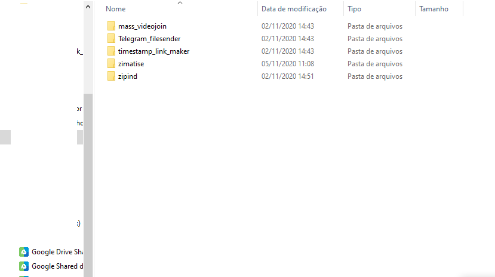

# GUIA DO ZIMATISE - Produzir Coleções Online no Telegram

Versão v100

## Sumário

- [GUIA DO ZIMATISE - Produzir Coleções Online no Telegram](#guia-do-zimatise---produzir-coleções-online-no-telegram)
  - [Sumário](#sumário)
  - [Importante](#importante)
  - [Introdução](#introdução)
  - [1 - Preparando o ambiente](#1---preparando-o-ambiente)
    - [1.1 ffmpeg](#11-ffmpeg)
      - [Para obter o ffmpeg:](#para-obter-o-ffmpeg)
      - [Configurando o ffmpeg:](#configurando-o-ffmpeg)
        - [Adicionar pasta às variáveis de ambiente](#adicionar-pasta-às-variáveis-de-ambiente)
    - [1.2 python](#12-python)
      - [Para obter o python:](#para-obter-o-python)
    - [1.3 Compactadores-Winrar ou 7zip](#13-compactadores-winrar-ou-7zip)
  - [2 Preparação os utilitários](#2-preparação-os-utilitários)
    - [Como baixar](#como-baixar)
    - [Atualizações de dependências](#atualizações-de-dependências)
  - [3 Como utilizar os utilitários - O segredo do Processo Automático e Upload eficiente](#3-como-utilizar-os-utilitários---o-segredo-do-processo-automático-e-upload-eficiente)
    - [3.1 ETAPA 1 - Compactação de arquivos](#31-etapa-1---compactação-de-arquivos)
    - [3.2 ETAPA 2 - Gerar relatório de arquivos de vídeos](#32-etapa-2---gerar-relatório-de-arquivos-de-vídeos)
    - [3.3 ETAPA 3 - Reencode - Transformação de perfis](#33-etapa-3---reencode---transformação-de-perfis)
    - [3.4 ETAPA 4 - Agrupamento dos vídeos](#34-etapa-4---agrupamento-dos-vídeos)
    - [3.5 ETAPA 5 - Descrições dos vídeos e do Projeto](#35-etapa-5---descrições-dos-vídeos-e-do-projeto)
      - [3.5.1 Ajustes das Descrições](#351-ajustes-das-descrições)
    - [3.6 ETAPA 6 – O Upload](#36-etapa-6--o-upload)
      - [Upload via API do telegram](#upload-via-api-do-telegram)
        - [Configuração de token](#configuração-de-token)
        - [Envio para novo canal](#envio-para-novo-canal)
        - [Envio para canal já existente](#envio-para-canal-já-existente)
      - [Upload via Macro de Teclado](#upload-via-macro-de-teclado)
      - [Após o Upload](#após-o-upload)
  - [Customização e maiores detalhes](#customização-e-maiores-detalhes)
    - [Aplicação de assinatura no sumário do canal](#aplicação-de-assinatura-no-sumário-do-canal)
    - [Ativação do Efeito de Transição nos vídeos](#ativação-do-efeito-de-transição-nos-vídeos)
    - [Padronização de Descrição do projeto](#padronização-de-descrição-do-projeto)
    - [Separação dos vídeos e demais materiais](#separação-dos-vídeos-e-demais-materiais)
    - [Definição de limites de tamanho e duração](#definição-de-limites-de-tamanho-e-duração)
    - [Ajustes manuais no plano de reencode](#ajustes-manuais-no-plano-de-reencode)
  - [Conclusão](#conclusão)

## Importante

Nenhum dos softwares utilizados nesse tutorial possui relação direta como o objetivo deste tutorial.

O uso dos softwares em conjunto para qualquer objetivo, é por uma decisão individual de responsabilidade de cada usuário.

## Introdução

Este tutorial ensinará como disponibilizar uma coleção audiovisual no telegram de modo que possa ser assistida online, sem precisar fazer download.


Com funções especiais, como:
- Agrupados de equenos videos em grandes blocos, para reduzir a quantidade de vídeos postados
- Menu interativo na descrição dos blocos, para navegar entre os diferentes capítulos
- Assinatura personalizada em cada postagem
- Materais de não-videos (pdfs e etc) lançados em pacotes divididos de forma independente
- Descrição do canal gerada automaticamente em modelo preconfigurado. Podendo descrever tamanho do material, duração e link de convite
- Efeitos de transição entre os capítulos de um bloco de vídeo
- Criação automática de novo canal para cada novo projeto
- Inclusão automática de administradores durante a criação do canal

[Neste canal](https://t.me/+KMgiIG8OU8BmNTUx) é possível visualizar um exemplo do resultado que você será capaz de produzir ao seguir este tutorial.

O processo foi construído para ser eficiente, não tomando mais que 3 minutos de atenção para finalizar um projeto, ainda que contenha dezenas de horas e centenas de gbs.

## 1 - Preparando o ambiente

O Zimatise é o app que facilita o fluxo de atividade para processar e upar coleções audiovisuais no telegram.

Por baixo do fluxo de atividade, existem 4 apps especialistas: O Zipind, mass_videojoin, timestamp_link_maker e o telegram_filesender.

Para esses apps funcionarem, é necessário instalar algumas dependências:
O ffmpeg, python e o Compactador.

### 1.1 ffmpeg

O ffmpeg é uma "caixa de ferramenta" que pode ser utilizada via linha de comando por qualquer linguagem de programação para fazer dezenas de operações com arquivos áudio, vídeo e legendas, incluindo transformar vídeos (codecs, resolução, bitrate) e extrair quaisquer informações (metadados) sobre esses arquivos.

#### Para obter o ffmpeg:
- Baixe a partir deste [link direto]((https://www.gyan.dev/ffmpeg/builds/ffmpeg-git-full.7z)), que contém a versão completa e atualizada do programa. Ou siga os passos abaixo.
- Acesse [https://ffmpeg.org/download.html](https://ffmpeg.org/download.html).
- No campo “get packages & executable files”, clique no botão que representa o Windows.
- Logo em seguida, escolha a opção `Windows builds from gyan.dev`
- Em seguida clique no link [https://www.gyan.dev/ffmpeg/builds/ffmpeg-git-full.7z](https://www.gyan.dev/ffmpeg/builds/ffmpeg-git-full.7z)

#### Configurando o ffmpeg:
- Felizmente o ffmpeg não se instala, sendo uma aplicação portátil (portable). É necessário apenas o configurar para que seja possível o utilizar por terminal a partir de qualquer local ou pasta do PC. Este processo é chamado de `Adicionar pasta às variáveis de ambiente`

Primeiramente é preciso obter o caminho da pasta `bin` que existe dentro da pasta criada para o ffmpeg.
- Caso se tenha criado a pasta do ffmpeg na "unidade C", a pasta `bin` estará no caminho: `C:\ffmpeg\bin`. Guarde o caminho da pasta, pois será usada na inclusão às variáveis de ambiente.

##### Adicionar pasta às variáveis de ambiente
Será ensinado duas formas de fazer isso:
- A rápida, via terminal
- E simpática, via interface gráfica (GUI)

Execute apenas uma das formas.

**Rápido: Via Terminal**

- Abrir Terminal com privilégio de admin
  - `[WIN]+R, cmd, [CTRL]+[SHIFT]+[ENTER]`
- Entrar com o comando: `setx /M path "%path%;{path_folder}"`
	- Substituir `{path_folder}` pelo link da pasta a ser adicionada nas variáveis de sistema
	- Exemplo caso a pasta esteja em `C:\myapp`
		- `setx /M path "%path%;C:\myapp"`


**Simpático: Via interface gráfica**
- Escolha um diretório e crie uma pasta com o nome `ffmpeg`.
- O arquivo baixado deve ser extraído nesta pasta vazia que foi criada.
- Para o ffmpeg ser acessável via terminal a partir de qualquer local do seu sistema, busque o termo `variáveis de ambiente` na ferramenta de busca do windows e acesse a aplicação `editar as variáveis de ambiente do sistema`.
- Na aplicação que será aberta, acesse a guia `Avançado` e clique no botão `Variáveis de Ambiente`.


- No form "Variáveis de Ambiente", clique no nome `Path` na coluna `Variável`. Em seguida clique no botão `Editar`.


- No form "Editar a variável de ambiente", clique no botão "Novo" e adicione o caminho da pasta `bin` que existe dentro da pasta criada para o ffmpeg.
- Caso se tenha criado a pasta na "unidade C", a pasta `bin` estará no caminho: `C:\ffmpeg\bin`


- Para evitar erros, logo após adicionar o novo caminho, selecione o novo caminho adicionado, em seguida clique no botão `Mover para Cima`.
- Esta ação dará ao path criado, maior prioridade em relação aos demais paths da lista.


- Parabéns. O ffmpeg foi configurado como variável de sistema!
- Para verificar se está tudo funcionando bem, basta abrir o cmd do Windows: (`[ctrl]+[r], cmd, [enter]`)
- Em seguida digite `ffmpeg` no terminal aberto e tecle `[Enter]`. O resultado deve ser similar a imagem abaixo.


### 1.2 python
Python é uma linguagem de programação de propósito genérico ao qual o Zimatise e seus apps dependentes foram construídos.

#### Para obter o python:
* Acesse o site python.org e [baixe a versão 3.8.10](https://www.python.org/ftp/python/3.8.10/python-3.8.10-amd64.exe)
* No form 'Advanced Options', marque `Add python 3.8 to PATH`. Esta função automatiza a inclusão do Python no Path do windows, dispensando a repetição do trabalho executado no tópico anterior, com o ffmpeg.
* Clique em `Install`
* A instalação pode demorar alguns minutos, mas isso é normal.


### 1.3 Compactadores-Winrar ou 7zip
Winrar ou 7zip são softwares compactadores que permitem agregar vários arquivos dentro de um único arquivo, facilitando o envio/recebimento de todo o 'pacote de arquivos' como um único arquivo.

App [Winrar](https://www.win-rar.com/predownload.html?&L=9)
- Possibilita usar a suite para compactar arquivos em modo '.rar'.
- Exclusivo para sistema operacional Windows.

App [7zip](https://www.7-zip.org/download.html)
- Possibilita usar a suite para compactar arquivos em modo '.zip'.
- Funciona em Windows e Linux.
- Preferência de quem usa sistema operacional Linux.

Configuração:
- Instale o compactador que preferir ou ambos.
- Adicione a pasta do app às variáveis de ambiente seguindo os mesmos passos realizados anteriormente quando se instalou o ffmpeg, no tópico `Adicionar pasta às variáveis de ambiente`.


## 2 Preparação os utilitários

> Importante\
> Os utilitários devem ser colocados dentro de uma pasta na raiz de uma unidade do seu pc. Ex.: `D:/zimatise_suite`\
> Este detalhe evita que existam erros de [max_path](https://docs.microsoft.com/pt-br/windows/win32/fileio/maximum-file-path-limitation) durante o processamento dos projetos.

Baixe os utilitários nos seguintes links:

1. Mass Video Join: [https://github.com/apenasrr/mass_videojoin](https://github.com/apenasrr/mass_videojoin)
2. Time Stamp Link Maker: [https://github.com/apenasrr/timestamp_link_maker](https://github.com/apenasrr/timestamp_link_maker)
3. Zipind: [https://github.com/apenasrr/zipind](https://www.google.com/url?q=https://github.com/apenasrr/zipind&sa=D&ust=1608417945410000&usg=AOvVaw22EBq1e5Hj2e1qtxo5p8lj)
4. Telegram_filesender: [https://github.com/apenasrr/Telegram_filesender](https://github.com/apenasrr/Telegram_filesender)
5. Zimatise: [https://github.com/apenasrr/zimatise](https://github.com/apenasrr/zimatise)

### Como baixar
- Clique no botão “Code” e, em seguida,
- Clique em “Download ZIP”.
- Repita o procedimento na página de cada utilitário


- Extraia todos os utilitários na pasta criada para a suite.
- Renomeie as pastas de cada utilitário, tirando o `“-master”` do nome cada uma. O resultado final deve ser esse:


```
CURIOSIDADE

O passo acima só foi necessário porque os utilitários foram baixados através do botão 'code' no site do github.
Se tivessem sido baixados por linha comando (git clone), as pastas apareceriam da forma desejada.
Para saber mais: https://docs.github.com/pt/github/creating-cloning-and-archiving-repositories/cloning-a-repository
```

- Garanta de que as extensões de arquivo estão sendo exibidas, indo no menu “Exibir” e então marcando o checkbox “Extensões de nomes de arquivos”.


`ATENÇÃO: OS PASSOS A SEGUIR DEVEM SER REPETIDOS EM TODOS OS UTILITÁRIOS.`

### Atualizações de dependências
O python é uma linguagem de programação, onde durante a atividade de programação, vários 'atalhos' são pegos através do uso de scripts que foram criados por outras pessoas. Esses scripts são chamados de 'Libs' (bibliotecas).

Cada utilitário composto pelo Zimatise possui diversas libs requeridas, que precisamos baixar e atualizar.

Para facilitar o processo, tudo foi resumido à execução de 1 arquivo.
- Para cada pasta de utilitário, abra sua pasta e execute o arquivo `update_libs.bat`.


## 3 Como utilizar os utilitários - O segredo do Processo Automático e Upload eficiente

Agora que todas as ferramentas estão prontas, é hora de usá-las.

- Acesse a pasta do Zimatise e execute o arquivo “zimatise_one.bat”
- Será aberta um `terminal` com um menu simples

### 3.1 ETAPA 1 - Compactação de arquivos

- No menu de opções, escolha a primeira opção digitando `1` e confirmando ao teclar `[Enter]`


> `AVISO: Lembre-se de teclar [Enter] após digitar uma resposta em cada etapa.`

> ATENÇÃO\
> Mova a pasta do projeto para a raiz de sua unidade de disco.\
> Caso seu disco principal seja a unidade `C` e a pasta do projeto se chame `meu_projeto`, após a pasta ser movida, o caminho para ela será: `C:\meu_projeto`.\
> Este processo é importante pois o arquivo compactado preserva a estrutura hierárquica das pastas, gerando um resultado inconveniente caso o projeto esteja submerso entre diversas pastas no seu PC.\
> Após a finalização do projeto, ele naturalmente pode ser movido de volta para a pasta que o usuário achar conveniente.
- Informe o caminho da pasta raiz do projeto.
- Para copiar o caminho, acesse a pasta pelo `Windows Explorer` e tecle `[ctrl]+[L], [ctrl]+[c]`
- Caso ao tentar no colar no terminal, o atalho `[ctrl]+[v]` não funcione, clique com o botão direito do mouse dentro do terminal, que o caminho será colado.
- Confirme com `[Enter]` duas vezes
- O processo de compactação será como na próxima imagem:


### 3.2 ETAPA 2 - Gerar relatório de arquivos de vídeos

Esta etapa se resume em agrupar os vídeos em grandes blocos com uma determinada duração máxima em horas e/ou de tamanho máximo definido em megabytes.

Para gerar esse efeito, os vídeos a serem agrupados preciam ter o mesmo perfil, com o mesmo **encode de áudio, vídeo** e mesma **resolução**.

O processo de transformação dos perfis para serem iguais entre si, se chama `homogeneização de perfis`.

Para fazer esta análise e dá as instruções de transformação, siga os passos:
- Ative a segunda opção digitando `2`
- Informe o caminho da pasta do projeto novamente e aguarde o processo de listagem
- Após a conclusão do processo, o utilitário informará os perfis encontrados nos vídeos da pasta e montará um plano de ajuste automático (processo de reencode) de modo que cada subpasta de primeiro nível passe a ter vídeos de perfis iguais.

\
Para o exemplo da imagem acima, existem apenas 5 minutos de vídeo para ser reencodado, na última pasta do projeto.

> ATENÇÃO\
> Execute a próxima etapa mesmo que não haja minutos de vídeo para ser reencodado, pois nesta etapa também são geradas transformações no relatório que são essenciais para o processo seguir adequadamente.

### 3.3 ETAPA 3 - Reencode - Transformação de perfis

O próximo passo é o de reencodar os vídeos, para que fiquem com o mesmo perfil de encode/resolução e assim possibilite seu agrupamento.

Este processo pode demorar entre 10% e 50% da duração total dos vídeos à serem transformados de acordo com o plano de reencode.

Assim, se o plano de reencode contiver 10 horas de vídeos, o processo de reencode pode demorar entre 1 à 5 horas, dependendo da potência de sua CPU.

- Selecione a terceira opção digitando `3` e aguarde a conclusão do processo.


- Após o final do processo de reencode, o resultado será similar ao da imagem a seguir:


### 3.4 ETAPA 4 - Agrupamento dos vídeos

- O agrupamento obedecerá 5 critérios:
  - Vídeos com perfil (resolução/codec), processado na etapa de reencode
  - Limites de tamanho de arquivo e duração máxima dos vídeos
  - E ajustes manuais pelo usuário realizados no relatório
- Selecionar a quarta opção digitando `4` e tecle `[Enter]`
- Ao aparecer a mensagem `Review the file and then type something to start (...)`, é possível fazer ajustes manuais no plano de reencode, que será ensinado mais adiante neste tutorial.
- Tecle `[Enter]` novamente para iniciar o processo de agrupamento dos vídeos.


### 3.5 ETAPA 5 - Descrições dos vídeos e do Projeto

Este é a etapa da geração planilha `descriptions.xlsx`, que contém as descrições dos blocos de vídeos, com marcação temporal (timestamps) que servirá de menu de navegação para cada bloco.

Também será gerado o arquivo `header_project.txt`, contendo a descrição do Canal conforme modelo configurado.

Ambos arquivos serão salvos na pasta do projeto, dentro da pasta do utilitário Zimatise.
- Selecionar a quinta opção digitando `5`
- Confirme com a tecla `[Enter]` para gerar o arquivo `descriptions.xlsx`.
- Após gerado, aparecerá a mensagem: `TimeStamp and descriptions files created`


#### 3.5.1 Ajustes das Descrições

- Acesse o relatório `descriptions.xlsx`
- Caso exista avisos na coluna `"warning"` indicando `"max size reached"`, significa que para o vídeo daquela linha, a descrição gerada ultrapassa o limite do Telegram de 1000 caracteres (contendo os espaços).


- Essas descrições precisam ser alteradas para evitar uma colagem incompleta no Telegram.
- Para alterar, clique duas vezes na célula da descrição com problemas
- Ela se expandirá e será possível copiar o texto e colá-lo em um editor de texto (para fechar a célula, basta apertar `Esc`), ou ainda alterar no próprio Excel.
- Nesse tutorial será utilizado o software "Microsoft Word" para corrigir as descrições com problemas.


- Usando a contagem de caracteres do Word é possível ver quantos caracteres existem no documento, e, por dedução, quantos deverão ser cortados:


- Uma função muito útil do Word para correção de textos é a de substituição, segue um exemplo de uso:


- Depois que a descrição estiver com 1000 caracteres ou menos, copie e a cole na célula do Excel de onde ela foi originalmente copiada.

### 3.6 ETAPA 6 – O Upload
Existem dois métodos para fazer o upload para o Telegram.

O método automatizado via Macro de Teclado e o método através da API do telegram.

Neste tutorial, ambos métodos serão abordados, mas é recomendado utilizar o método através da API do telegram, para ser mais eficiente no processo e minimizar riscos de erros manuais.

> Por que enviar pela API do Telegram?\
> R: Porque é mais rápido. Não gera conflito com máquinas virtuais onde você não pode utilizar macro de mouse/teclado. Não ocupa sua máquina durante a preparação do envio. Não congela a capacidade de enviar arquivos em seu app do Telegram enquanto upa os vídeos.

> Quando enviar via Telegram app é preferível?\
> R: Quando você tem preguiça de aprender a gerar um token de acesso para sua conta do telegram e configurar no Zimatise. Preguiça essa que te fará perder muito mais tempo no upload de todos os projetos que processar.

#### Upload via API do telegram

##### Configuração de token
Para se conectar ao Telegram via API, é necessário obter um `api_id` e um `api_hash`.\
Mas não se preocupe, só é necessário seguir essas etapas uma vez na vida:
- Para obter as credenciais para a API do Telegram:
  - Acesse a área de [gestão de apps](https://my.telegram.org/auth?to=apps) no site do telegram.
  - Entre com seu número de telefone em modelo internacional. Com prefixo `+55` para o caso de telefone brasileiro, seguido do DDD local e seu número de telefone.
    - Exemplo: Para telefone de São Paulo, com ddd 11, deverá ser digitado algo como: `+5511995429405`
  - Preencha o formulário e então aparecerá seus códigos de `api_id` e `api_hash`
  - Para assistir o processo em detalhes, assista [este vídeo](https://www.youtube.com/watch?v=8naENmP3rg4) que exemplifica tudo rapidamente.
- Após obter sua `api_id` e `api_hash`
- Na pasta do Telegram_filesender, abra o arquivo `credentials.py` em qualquer editor de texto, como o notepad.
- Preencha as flags `api_id` e `api_hash` com os dados que você salvou. Semelhante ao exemplo abaixo:
  - `api_id = 1111111`
  - `api_hash = "sKwrdX7tb2xFDkPU9h0AsKwrdX7tb2xF"`
- Os valores informados acima são apenas exemplos. Os valores são inválidos.
- Salve e feche o arquivo

##### Envio para novo canal
- Caso deseje criar um novo canal (opção mais rápida :satisfied:):
  - Não é necessário ajustar, pois o zimatise vem configurado para criação automática de novo canal para cada projeto.
  - Caso deseje **adicionar adms** automaticamente ao novo canal, adicione seus @Nicks (1 para cada linha) no arquivo: `Telegram_filesender\config\channel_adms.txt`
  - Caso deseje **personalizar automaticamente a descrição** do novo canal, é importante lembrar que o conteúdo já foi criado baseado num template, na Etapa 5. Mas caso prefira, revise:
    - Abra a pasta do projeto presente na pasta do Zimatise
    - Acesse o arquivo `header_project.txt` e customize conforme necessário, mas atendo para que a primeira linha seja o nome do canal e as demais linhas correspondam a sua descrição.
    - Se desejar, use a flag `{chat_invite_link}` para substituir automaticamente pelo link de convite para o novo canal.
> Nota: A substituição automática do `link de convite` é mais uma das vantagens do método de envio `'Via Telegram API'` em relação ao método `'via Macro de Teclado'`

##### Envio para canal já existente
Caso deseje enviar para um grupo/canal já existente (opção mais lenta :neutral_face:):
- Ajuste o arquivo de configuração
  - Primeiro, é preciso obter o `chat_id` do grupo/canal. Existem várias formas de obter o chat_id de um canal. Mostraremos duas delas:
    - Usando o telegram client [Kotatogram](https://kotatogram.github.io/download/):
      - Acesse a tela de descrição do canal
      - Copie o `chat_id` que aparece abaixo do nome do canal
    - Usando bot Find_TGIDbot:
      - Acesse a janela do bot [@Find_TGIDbot](http://t.me/Find_TGIDbot) e o inicie
      - Encaminhe qualquer postagem do canal para este bot
      - O bot responderá com o ID do remetente da mensagem. Neste caso, o ID do canal.
    - Copie o `chat_id` (incluindo o sinal de subtração). Vale ressaltar que canais começam com o número '-100'.
  - Abra o arquivo `Telegram_filesender/config/config_tg.py` em qualquer editor de texto
  - Altere a flag `chat_id` para o valor do chat_id copiado, semelhante ao exemplo abaixo
  - Exemplo: `chat_id = -111111111`
  - Altere a flag `create_new_channel` para` 0`, igual ao exemplo abaixo
  - Ex.: `create_new_channel = 0`
  - Salve e feche o arquivo

- Na janela do Zimatise, tecle `6` e confirme com `[Enter]`
- Tecle novamente `[Enter]` confirmando que será utilizado o arquivo `descriptions.xlsx` existente
- Aparecerá a mensagem: `"How do you intend to send the files?"`
- Tecle `2`, informando que será utilizado o método via Telegram API.
- Aguarde a conclusão do Upload


#### Upload via Macro de Teclado
> Atenção
> Ressaltamos que este método não é indicado. É lento e passivo de frequentes falhas. Opte pelo método via API do telegram.

- Crie um novo canal privado no Telegram
- Na descrição, cole o conteúdo do arquivo `header_project.txt` gerado na pasta do projeto. O ajuste caso necessário.

O upload pelo método via Macro de Teclado consiste em o script passar comandos de teclado para que cada arquivo de vídeo seja jogado de forma sequencial no app do Telegram juntamente com sua descrição.

Para executar esse método, é necessário um pequeno preparo para funcionar adequadamente:
- Abra a pasta dos vídeos agrupados do projeto a ser upado. Normalmente a pasta fica em: `zimatise/projects/output_{nome_do_projeto}/output_videos`
- Selecione o primeiro arquivo de vídeo.
- Siga os passos abaixo nesta exata ordem:
1. Deixe a janela da pasta dos vídeos aberta
2. Depois abra a janela do Telegram
3. Depois abra a janela do Zimatise
- Faça isso utilizando o comando `alt + tab`, para evitar que a seleção do vídeo se perca.
- Caso tenha errado a ordem de ativação das janelas, repita o processo até conseguir ativar as 3 janelas na exata ordem descrita.
   > Atenção: Caso não faça desta forma, há grande risco da automação gerar erros.
- Na janela do zimatise, tecle `6` e confirme com `[Enter]`
- Nas opções que aparecerão, tecle `[Enter]` confirmando que será utilizado o arquivo `descriptions.xlsx` existente
- Aparecerá a mensagem: `"How do you intend to send the files?"`
- Tecle `1`, informando que será utilizado o método via Macro de Teclado, pelo app do Telegram.

- Neste momento não toque no teclado e aguarde a colagem dos vídeos no app do Telegram terminarQuando o processo automático terminar,

Caso prefira fazer o upload manualmente, não utilizando a função via Macro de Teclado, apenas arraste os vídeos para a janela do Telegram ou use o clipe de papel no canto inferior esquerdo do quadro do canal, copie e cole as descrições no relatório “descriptions.xlsx” e repita o processo para todos os blocos, na ordem correta.


#### Após o Upload
- Após o término do upload, poste o menu de navegação no canal para facilitar o acesso aos diferentes vídeos e arquivos do projeto.
- O texto do menu de navegação é o conteúdo do arquivo `summary.txt` presente na pasta do projeto.
- Por fim, é recomendado 'fixar' a mensagem colada clicando com o botão direito nela e selecionando a opção correspondente.


## Customização e maiores detalhes
### Aplicação de assinatura no sumário do canal
- O texto que aparecerá no post com o sumário dinâmico do material, possui um cabeçalho e rodapé personalizável.
- Para ajustar, altere o texto dos arquivos `“summary_top.txt”` (para cabeçalho) e `“summary_bot.txt”` (para rodapé), na pasta do utilitário timestamp_link_maker.
- No arquivo “summary_bot”, troque o texto que está lá por esse:

```
Bons estudos!


```

- No arquivo “summary_top”, troque o texto que está no arquivo por esse:

```
⚠ Atenção ⚠

Clique aqui para ver o Menu de navegação.
Utilize as # para navegar rapidamente entre os blocos de vídeos.


Materiais em #Materiais
```

### Ativação do Efeito de Transição nos vídeos
Esta função é opcional. Para desestimular a prática de cópia dos vídeos sem que haja citação a equipe que os processou, pequenos vídeos podem ser usados no início e final do bloco de vídeo, com também usado na forma de efeitos de transição, entre os diversos vídeos que foram agrupados.

O Zimatise é inteligente para gerar novos vídeos de transição com resoluções diferentes na medida em que haja necessidade de os agrupar com vídeos cuja resolução seja diferente das encontradas até então.

Para evitar grandes distorções no processo de adaptação de resolução, é recomendado que se crie 2 vídeos de transição com **alta definição**, mas possuindo uma relação de largura/altura (aspect ratio) de `16:9` e outra com `4:3`.
- Acesse a pasta do utilutário `mass_videojoin`
- Em seguida acesse a pasta `transition`. Crie caso ela não exista.
- Cole os vídeos de transição nessa pasta.
- Em seguida acesse o arquivo de configurações (`mass_videojoin\config\config.txt`) e defina a flag `activate_transition` como `'true'`.
- Caso não tenha interesse em usar o Efeito de Transição, defina a flag como `'false'`.


### Padronização de Descrição do projeto
A descrição do projeto pode ser automaticamente gerada, com algumas variáveis padronizadas, como tamanho do projeto em megabytes, duração em horas e até o 'link de convite', caso seja posteriormente utilizado API do Telegram no utilitário `Telegram_filesender` para subir os arquivos.
- Acesse o arquivo `zimatise\header_template.txt`
- O preencha com o texto abaixo:

```
{project_name}

{project_name}

Tamanho: {file_size}
Duração: {duration}

Convite: {chat_invite_link}


```

### Separação dos vídeos e demais materiais
Vídeos serão disponibilizados via streamming, mas demais arquivos serão empacotados. Para aplicar este método, é necessário informar ao Zimatise quais tipos de arquivos não deverão ser empacotados. Nativamente é informado uma lista de extensões de vídeos que guia essa separação, mas você pode ajustar essa listagem.
- Acesse a pasta do utilitário `zimatise`
- Abra o arquivo `config.ini`
- Na flag `video_extensions`, você pode alterar a lista de extensões de vídeos.


### Definição de limites de tamanho e duração
O processo de agrupamento dos vídeos é guiado por alguns limites para que o projeto não seja consolidado num único vídeo com dezenas de horas e gigabytes. A definição de limites sugerida está em sintonia com uma boa experiência em se assistir vídeos por stream.

- Acesse a pasta do utilitário `zimatise`
- Abra o arquivo `config.ini`
- Na flag `size_per_file_mb`, se altera o limite máximo em megabytes de cada bloco de vídeo.
- Na flag `duration_limit`, se altera a duração máxima de um bloco de vídeo.

### Ajustes manuais no plano de reencode
- Após o passo 3, quando aparecer a mensagem `"File [...] was updated with group column to fast join"`
- Neste momento é possível fazer ajustes manuais no plano de agrupamento, através do relatório `video_details.xlsx` presente na pasta do projeto dentro da pasta do `Zimatise`.
- Na coluna `group_encode`, é possível indicar que determinados vídeos fiquem em blocos diferentes dos que foram previamente alocados, alterando sua numeração sequencial.
- Este ajuste manual é útil para projetos sem hierarquia de pastas, onde a separação de módulos depende do julgamento de quem está operando.
- Como exemplo, a imagem abaixo demonstra um projeto cujo plano de agrupamento foi ajustado manualmente para que vídeos de módulos diferentes fiquem em blocos diferentes. Sendo os primeiros 4 vídeos num bloco. Do 5º ao 8º em outro boco. 9º ao 11º em outro bloco. E por fim, o último vídeo sozinho num bloco. As numerações dos grupos são sempre sequenciais.


## Conclusão

Ficamos felizes que você tenha concluído este tutorial.

Sua construção foi trabalhosa e gostaríamos de sua ajuda para torná-lo mais fácil de ser compreendido pelo maior número de pessoas.

Quer ajudar a melhorar o tutorial?
- [Abra um issue](https://docs.github.com/pt/issues/tracking-your-work-with-issues/creating-an-issue) sugerindo melhorias